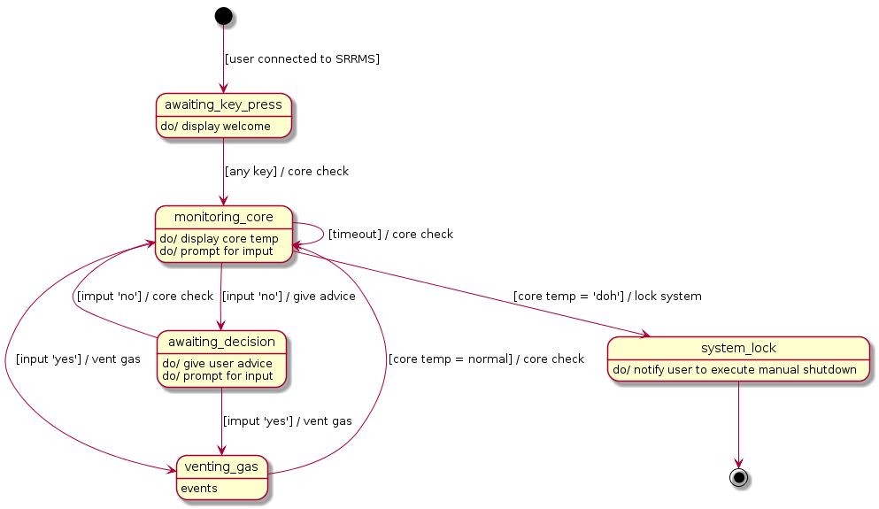

Elixirfied HomerFSM
===================

Resources
---------

-   [The orginal erlang project](https://howistart.org/posts/erlang/1)
-   [Finite state machine in elixir with fsm : part 1](https://isotope11.com/blog/a-tour-of-finite-states-in-elixir-part-1)
-   [Finite state machine in elixir with fsm : part 2](https://isotope11.com/blog/a-tour-of-finite-state-machines-in-elixir-part-2)

Dependencies
------------

-   [fsm](https://github.com/sasa1977/fsm)

HomerFSM State Diagram
----------------------

TODO stately states \[3/6\]
---------------------------

-   \[X\] userconnecting
-   \[X\] awaitingkeypress
-   \[X\] monitoringcore
-   \[ \] awaitingdecision
-   \[ \] ventinggas
-   \[ \] systemlock
